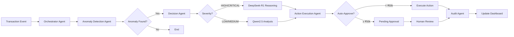

<div align="center">

# 🧠 Cost Intelligence System 

### Self-Healing Enterprise Cost Intelligence & Autonomous Action Platform

[](https://fastapi.tiangolo.com/)
[](https://nextjs.org/)
[](https://www.python.org/)
[](https://www.typescriptlang.org/)
[](https://www.postgresql.org/)
[](https://redis.io/)
[](https://www.docker.com/)

*An AI-powered autonomous system that detects cost anomalies, makes intelligent decisions, and executes corrective actions in real-time.*

[Features](#-features) • [Architecture](#-architecture) • [Quick Start](#-quick-start) • [Documentation](#-documentation) • [Demo](#-demo)

</div>

---

## 📋 Table of Contents

- [Overview](#-overview)
- [Key Features](#-features)
- [System Architecture](#-architecture)
- [Technology Stack](#-technology-stack)
- [Quick Start](#-quick-start)
- [Configuration](#-configuration)
- [AI Agents](#-ai-agents)
- [API Documentation](#-api-documentation)
- [Development](#-development)
- [Testing](#-testing)
- [Deployment](#-deployment)
- [Contributing](#-contributing)
- [License](#-license)

---

## 🎯 Overview

The **Cost Intelligence System** is an enterprise-grade platform that autonomously monitors, analyzes, and optimizes organizational costs using multi-agent AI architecture. Built for the ET Gen AI Hackathon 2026 (Problem Statement #3), it combines real-time anomaly detection, intelligent decision-making, and automated action execution to reduce costs and prevent budget overruns.

### Why Cost Intelligence?

- **Proactive Detection**: Identifies cost anomalies before they become critical issues
- **Autonomous Actions**: Executes corrective measures automatically with human-in-the-loop approval
- **Intelligent Routing**: Uses specialized AI models (Qwen2.5, DeepSeek-R1, Llama3.2) for optimal decision-making
- **Real-time Monitoring**: WebSocket-based dashboard for live updates and insights
- **Self-Healing**: Automatically resolves common cost issues without manual intervention

---

## ✨ Features

### 🔍 Anomaly Detection
- **Multi-Pattern Detection**: Identifies duplicate payments, unused licenses, SLA breaches, and budget overruns
- **Severity Classification**: Categorizes anomalies from LOW to CRITICAL with confidence scores
- **Historical Analysis**: Learns from past patterns to improve detection accuracy
- **Real-time Alerts**: Instant notifications via WebSocket and email

### 🤖 AI-Powered Decision Making
- **Multi-Agent Architecture**: Specialized agents for detection, decision, action, and audit
- **Intelligent Model Routing**: 
  - **Qwen2.5:7b** - Default model for standard operations
  - **DeepSeek-R1:7b** - Reasoning model for HIGH/CRITICAL severity cases
  - **Llama3.2:3b** - Fallback model for timeout scenarios
- **Budget-Aware**: Limits expensive model calls with configurable thresholds
- **Context-Aware**: Considers transaction history, vendor patterns, and business rules

### ⚡ Autonomous Actions
- **Auto-Execution**: Automatically executes approved actions below threshold (₹50,000)
- **Human-in-the-Loop**: Requires approval for high-value actions
- **Action Types**:
  - Cancel duplicate payments
  - Revoke unused licenses
  - Escalate SLA breaches
  - Negotiate vendor contracts
  - Optimize resource allocation
- **Rollback Support**: Tracks action history for audit and reversal

### 📊 Real-time Dashboard
- **Live Updates**: WebSocket-powered real-time data streaming
- **Interactive Visualizations**: Charts, graphs, and metrics
- **Approval Workflow**: One-click approve/reject interface
- **Savings Tracker**: Cumulative cost savings and ROI metrics
- **System Health**: Model status, queue depth, and performance metrics

### 🔐 Enterprise Features
- **Audit Trail**: Complete logging of all actions and decisions
- **Role-Based Access**: Configurable approval workflows
- **Email Notifications**: MailHog integration for alerts
- **API-First Design**: RESTful APIs with OpenAPI documentation
- **Scalable Architecture**: Async processing with Redis queue

---

## 🏗️ Architecture

```
┌─────────────────────────────────────────────────────────────────┐
│                        Frontend (Next.js)                        │
│  ┌──────────────┐  ┌──────────────┐  ┌──────────────┐          │
│  │  Dashboard   │  │  Approvals   │  │   Savings    │          │
│  └──────────────┘  └──────────────┘  └──────────────┘          │
└────────────────────────────┬────────────────────────────────────┘
                             │ HTTP/WebSocket
┌────────────────────────────┴────────────────────────────────────┐
│                     Backend (FastAPI)                            │
│  ┌──────────────────────────────────────────────────────────┐   │
│  │              Orchestrator Agent (Coordinator)            │   │
│  └───┬──────────────────┬──────────────────┬───────────────┘   │
│      │                  │                  │                    │
│  ┌───▼────────┐  ┌──────▼──────┐  ┌───────▼────────┐          │
│  │  Anomaly   │  │  Decision   │  │     Action     │          │
│  │ Detection  │  │    Agent    │  │   Execution    │          │
│  │   Agent    │  │             │  │     Agent      │          │
│  └────────────┘  └─────────────┘  └────────────────┘          │
│                                                                  │
│  ┌──────────────────────────────────────────────────────────┐   │
│  │              LLM Router (Model Selection)                │   │
│  │  Qwen2.5:7b  │  DeepSeek-R1:7b  │  Llama3.2:3b          │   │
│  └──────────────────────────────────────────────────────────┘   │
└────────────────────────────┬────────────────────────────────────┘
                             │
┌────────────────────────────┴────────────────────────────────────┐
│                    Infrastructure Layer                          │
│  ┌──────────────┐  ┌──────────────┐  ┌──────────────┐          │
│  │  PostgreSQL  │  │    Redis     │  │   Ollama     │          │
│  │  (Database)  │  │  (Queue/Pub) │  │  (LLM Host)  │          │
│  └──────────────┘  └──────────────┘  └──────────────┘          │
└─────────────────────────────────────────────────────────────────┘
```

### Agent Workflow



---

## 🛠️ Technology Stack

### Backend
- **Framework**: FastAPI 0.115.5 (async Python web framework)
- **Database**: PostgreSQL 16 (relational data storage)
- **Cache/Queue**: Redis 7 (pub/sub, task queue)
- **AI/ML**: Ollama (local LLM hosting)
  - Qwen2.5:7b (default model)
  - DeepSeek-R1:7b (reasoning model)
  - Llama3.2:3b (fallback model)
- **Async**: asyncpg, asyncio, httpx
- **Scheduling**: APScheduler (15-min scans)
- **Testing**: pytest, pytest-asyncio, factory-boy

### Frontend
- **Framework**: Next.js 16.2 (React 19)
- **Language**: TypeScript 5
- **Styling**: Tailwind CSS 4
- **HTTP Client**: Axios
- **Icons**: Lucide React
- **Real-time**: WebSocket API

### Infrastructure
- **Containerization**: Docker + Docker Compose
- **Email**: MailHog (SMTP testing)
- **API Docs**: OpenAPI/Swagger
- **Monitoring**: Built-in health checks

---

## 🚀 Quick Start

### Prerequisites

- **Docker** & **Docker Compose** (recommended)
- **Ollama** installed and running on host machine
- **Python 3.11+** (for local development)
- **Node.js 20+** (for frontend development)

### Option 1: Docker Compose (Recommended)

1. **Clone the repository**
```bash
git clone <repository-url>
cd cost-intelligence
```

2. **Set up environment variables**
```bash
cp .env.example .env
# Edit .env with your configuration
```

3. **Install and start Ollama models** (on host machine)
```bash
# Install Ollama from https://ollama.ai
ollama pull qwen2.5:7b
ollama pull deepseek-r1:7b
ollama pull llama3.2:3b
```

4. **Start all services**
```bash
docker-compose up -d
```

5. **Access the application**
- **Frontend**: http://localhost:3000
- **Backend API**: http://localhost:8000
- **API Docs**: http://localhost:8000/docs
- **MailHog UI**: http://localhost:8025

### Option 2: Local Development

#### Backend Setup
```bash
cd cost-intelligence/backend

# Create virtual environment
python -m venv venv
source venv/bin/activate  # On Windows: venv\Scripts\activate

# Install dependencies
pip install -r requirements.txt

# Set up database
# (Ensure PostgreSQL is running)
python -m db.database  # Run migrations

# Start server
uvicorn main:app --reload --host 0.0.0.0 --port 8000
```

#### Frontend Setup
```bash
cd cost-intelligence/frontend

# Install dependencies
npm install

# Start development server
npm run dev
```

---

## ⚙️ Configuration

### Environment Variables

Key configuration options in `.env`:

```bash
# Database
POSTGRES_DB=cost_intelligence
POSTGRES_USER=ci_user
POSTGRES_PASSWORD=ci_pass
POSTGRES_HOST=localhost
POSTGRES_PORT=5432

# Redis
REDIS_HOST=localhost
REDIS_PORT=6379

# Ollama (LLM)
OLLAMA_HOST=http://host.docker.internal:11434
MODEL_DEFAULT=qwen2.5:7b
MODEL_REASONING=deepseek-r1:7b
MODEL_FALLBACK=llama3.2:3b

# Routing Thresholds
DEEPSEEK_TRIGGER_SEVERITY=HIGH
DEEPSEEK_CONFIDENCE_THRESHOLD=0.80
MAX_DEEPSEEK_CALLS_PER_HOUR=10
AUTO_APPROVE_LIMIT=50000

# Cost Thresholds
SLA_ESCALATION_THRESHOLD=0.70
DUPLICATE_WINDOW_DAYS=30
UNUSED_LICENSE_DAYS=60
```

### Model Routing Configuration

The system intelligently routes requests to appropriate models:

| Scenario | Model | Reason |
|----------|-------|--------|
| Standard operations | Qwen2.5:7b | Fast, efficient, cost-effective |
| HIGH/CRITICAL severity | DeepSeek-R1:7b | Advanced reasoning capabilities |
| Timeout/fallback | Llama3.2:3b | Lightweight, reliable |

---

## 🤖 AI Agents

### 1. Orchestrator Agent
**Role**: Coordinator and workflow manager

- Receives tasks from Redis queue
- Coordinates multi-agent pipeline
- Manages agent lifecycle and error handling
- Publishes results to Redis pub/sub

### 2. Anomaly Detection Agent
**Role**: Pattern recognition and anomaly identification

**Detection Patterns**:
- **Duplicate Payments**: Same vendor, amount, date within window
- **Unused Licenses**: No usage for 60+ days
- **SLA Breaches**: P(breach) ≥ 0.70 threshold
- **Budget Overruns**: Spending exceeds allocated budget

**Output**: List of `DetectionResult` with severity and confidence

### 3. Decision Agent
**Role**: Intelligent action recommendation

- Analyzes anomaly context and history
- Selects appropriate LLM based on severity
- Generates structured action recommendations
- Provides reasoning and confidence scores

**Model Selection Logic**:
```python
if severity in [HIGH, CRITICAL] and budget_available:
    use DeepSeek-R1  # Advanced reasoning
elif timeout or budget_exceeded:
    use Llama3.2     # Fast fallback
else:
    use Qwen2.5      # Default model
```

### 4. Action Execution Agent
**Role**: Action implementation and tracking

**Capabilities**:
- Execute approved actions via handlers
- Track action status and outcomes
- Calculate cost savings
- Handle rollbacks and errors

**Action Handlers**:
- `cancel_duplicate_payment`
- `revoke_unused_license`
- `escalate_sla_breach`
- `negotiate_vendor_contract`

### 5. Audit Agent
**Role**: Compliance and logging

- Logs all agent activities
- Maintains audit trail
- Tracks decision rationale
- Supports compliance reporting

---

## 📚 API Documentation

### Core Endpoints

#### Transactions
```http
GET    /api/transactions          # List all transactions
GET    /api/transactions/{id}     # Get transaction details
POST   /api/transactions          # Create transaction (triggers scan)
```

#### Anomalies
```http
GET    /api/anomalies             # List detected anomalies
GET    /api/anomalies/{id}        # Get anomaly details
POST   /api/anomalies/scan        # Trigger manual scan
```

#### Actions
```http
GET    /api/actions               # List all actions
GET    /api/actions/{id}          # Get action details
POST   /api/actions/{id}/execute  # Execute action
```

#### Approvals
```http
GET    /api/approvals             # List pending approvals
POST   /api/approvals/{id}/approve   # Approve action
POST   /api/approvals/{id}/reject    # Reject action
```

#### Dashboard
```http
GET    /api/dashboard/summary     # Dashboard metrics
GET    /api/dashboard/savings     # Savings breakdown
GET    /api/system/status         # System health
```

#### WebSocket
```http
WS     /ws/dashboard              # Real-time updates
```

### Interactive API Docs

Visit http://localhost:8000/docs for full Swagger UI documentation with:
- Request/response schemas
- Try-it-out functionality
- Authentication details
- Example payloads

---

## 💻 Development

### Project Structure

```
cost-intelligence/
├── backend/
│   ├── agents/              # AI agent implementations
│   │   ├── orchestrator.py
│   │   ├── anomaly_detection.py
│   │   ├── decision_agent.py
│   │   ├── action_execution.py
│   │   └── audit_agent.py
│   ├── action_handlers/     # Action execution logic
│   ├── core/                # Configuration and constants
│   ├── db/                  # Database schema and migrations
│   ├── middleware/          # FastAPI middleware
│   ├── models/              # Pydantic schemas
│   ├── routers/             # API endpoints
│   ├── services/            # Business logic
│   │   ├── llm_router.py    # Model selection
│   │   ├── redis_client.py  # Queue/pub-sub
│   │   └── websocket_server.py
│   ├── tests/               # Test suite
│   ├── main.py              # Application entrypoint
│   └── requirements.txt
│
├── frontend/
│   ├── src/
│   │   ├── app/             # Next.js app router
│   │   ├── components/      # React components
│   │   ├── lib/             # Utilities
│   │   └── types/           # TypeScript types
│   ├── public/              # Static assets
│   └── package.json
│
├── scripts/                 # Utility scripts
├── docker-compose.yml
├── .env.example
└── README.md
```

### Adding a New Agent

1. Create agent class in `backend/agents/`:
```python
from agents.base_agent import BaseAgent
from core.constants import AgentName

class MyAgent(BaseAgent):
    def __init__(self, db):
        super().__init__(AgentName.MY_AGENT, db)
    
    async def run(self, task):
        # Implementation
        pass
```

2. Register in `core/constants.py`:
```python
class AgentName(str, Enum):
    MY_AGENT = "MyAgent"
```

3. Integrate in orchestrator pipeline

### Adding a New Action Handler

1. Create handler in `backend/action_handlers/`:
```python
async def my_action_handler(
    action_id: int,
    params: dict,
    db: asyncpg.Connection
) -> dict:
    # Implementation
    return {"status": "success", "savings": 1000}
```

2. Register in action execution agent

---

## 🧪 Testing

### Backend Tests

```bash
cd backend

# Run all tests
pytest

# Run with coverage
pytest --cov=. --cov-report=html

# Run specific test file
pytest tests/test_agents.py

# Run with verbose output
pytest -v
```

### Frontend Tests

```bash
cd frontend

# Run linter
npm run lint

# Type checking
npx tsc --noEmit
```

### Integration Tests

```bash
# Start services
docker-compose up -d

# Run integration tests
pytest tests/integration/

# Check API health
curl http://localhost:8000/health
```

---

## 🚢 Deployment

### Production Checklist

- [ ] Update `.env` with production values
- [ ] Change `SECRET_KEY` to secure random string
- [ ] Configure production database credentials
- [ ] Set `APP_ENV=production`
- [ ] Enable HTTPS/TLS
- [ ] Configure email SMTP (replace MailHog)
- [ ] Set up monitoring and logging
- [ ] Configure backup strategy
- [ ] Review security settings
- [ ] Load test the system

### Docker Production Build

```bash
# Build production images
docker-compose -f docker-compose.prod.yml build

# Start services
docker-compose -f docker-compose.prod.yml up -d

# View logs
docker-compose logs -f
```

### Scaling Considerations

- **Horizontal Scaling**: Add more backend workers
- **Database**: Use connection pooling, read replicas
- **Redis**: Use Redis Cluster for high availability
- **Ollama**: Deploy on GPU-enabled instances
- **Load Balancer**: Use nginx or cloud load balancer

---

## 📊 Demo

### Sample Workflow

1. **Transaction Created**: New ₹75,000 payment to "Acme Corp"
2. **Anomaly Detected**: Duplicate payment found (same vendor, amount, date)
3. **Decision Made**: DeepSeek-R1 recommends cancellation (HIGH severity)
4. **Approval Required**: Amount exceeds ₹50,000 threshold
5. **Human Approves**: Finance team reviews and approves
6. **Action Executed**: Payment cancelled, ₹75,000 saved
7. **Dashboard Updated**: Real-time WebSocket notification
8. **Audit Logged**: Complete trail recorded

### Demo Data

The system seeds 500 transactions, 200 licenses, and 50 support tickets on first startup for demonstration purposes.

---

## 🤝 Contributing

Contributions are welcome! Please follow these guidelines:

1. Fork the repository
2. Create a feature branch (`git checkout -b feature/amazing-feature`)
3. Commit your changes (`git commit -m 'Add amazing feature'`)
4. Push to the branch (`git push origin feature/amazing-feature`)
5. Open a Pull Request

### Code Style

- **Python**: Follow PEP 8, use type hints
- **TypeScript**: Follow ESLint configuration
- **Commits**: Use conventional commits format

---

## 📄 License

This project is licensed under the MIT License - see the [LICENSE](LICENSE) file for details.

---

## 🙏 Acknowledgments

- **ET Gen AI Hackathon 2026** - Problem Statement #3
- **Ollama** - Local LLM hosting
- **FastAPI** - Modern Python web framework
- **Next.js** - React framework
- **PostgreSQL** - Reliable database
- **Redis** - Fast in-memory data store

---

## 📞 Support

For questions, issues, or feature requests:

- **Issues**: [GitHub Issues](https://github.com/your-repo/issues)
- **Discussions**: [GitHub Discussions](https://github.com/your-repo/discussions)
- **Email**: support@costintelligence.example.com

---

<div align="center">

**Built with ❤️ for ET Gen AI Hackathon 2026 by Team AI Apex**

⭐ Star this repo if you find it helpful!

</div>
